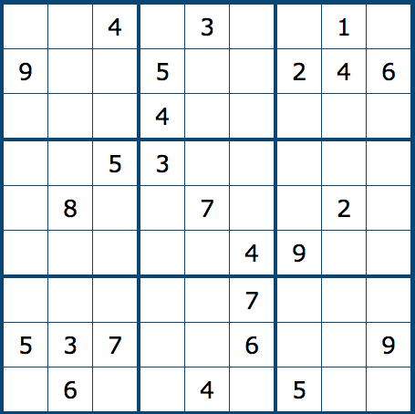

# Homework 2

There are two parts to this homework.
In the first part, you will create a minimax search agent to play the game [Isolation](https://en.wikipedia.org/wiki/Isolation_(board_game)).
In the second part, you will formulate Sudoku and scheduling problems as CSPs and solve them using a Python library called [`python-constraint`](https://labix.org/python-constraint). To install `python-constraint`, use: `pip install python-constraint`.

In addition to the code you must submit, you will also need to submit a writeup to Gradescope in the form of a file called `written.txt`.
This assignment is due on Thursday, October 10th at 11:59 PM.

## Part 1: Minimax (70%)

Read the rules of [Isolation](https://en.wikipedia.org/wiki/Isolation_(board_game)).
We have provided you with an implementation of the game in `game.py`.
Your job is to implement a minimax search agent capable of playing the game effectively.

### The Game Environment

Unlike the 7x7 version of the game in the Wikipedia article, our version of the game will allow any NxN board with N > 1.
The cells on the board, like the gridworld from HW1, will be referred to by `(x, y)` tuples, with `(0, 0)` in the top left corner.
When N is odd, the players will start in the middle column, in the top and bottom rows.
When N is even, there is no middle column, so the min (resp. max) player starts just to the right (resp. left) of center.
Note that the players' starting cells are empty from the beginning and therefore cannot be removed or returned to.

Start by taking a look at the game implementation in `game.py`.
The complete state of the game is represented by a `namedtuple` with the fields `board`, `min_pos`, `max_pos`, and `min_to_play`.
The `board` is a 2D list of 1s and 0s.
A 1 indicates that the cell still exists, while a 0 indicates it has been removed.
The `min_pos` and `max_pos` fields are `(x, y)` tuples indicating the positions of each player on the board.
Finally, `min_to_play` is a Boolean that is true when it's then min player's turn and false otherwise.

You should expect to take some time to read and fully understand the rest of the `game.py` file.
It will be hard to write your search function without a solid understanding of the game API.
**DO NOT MODIFY THE `game.py` FILE AT ALL FOR THIS HOMEWORK. YOU DO NOT NEED TO MAKE ANY CHANGES TO IT TO COMPLETE THE ASSIGNMENT, AND DOING SO WILL CAUSE YOU TO FAIL THE AUTOGRADER TESTS.**

### Creating a Minimax Search Agent (20%)

Your first step is to implement the basic minimax algorithm to solve Isolation.
We've provided a very minimal starter file for you including only the function signature.
You're free to define other functions, but your `MinimaxAgent` class must have the provided function `select_action(self, game, state)`.
The class constructor takes arguments for the evaluation function, search depth cutoff, and pruning method.
These have default values and won't be used until later in the assignment, so you can simply ignore them for this first stage.

Once you've written your minimax implementation, you should run some experiments to make sure it's behaving reasonably.
The 3x3 board is small enough that we can prove the second player (max) can always win with correct play.
This gives us a way to test our minimax agent.

1. First, play 1000 games on a 3x3 board, using the random agent for the min player and minimax for the max player.
This should take less than 15 seconds if your implementation is decently efficient, and minimax should win all 1000 games without exception.
If it loses even one game, there's a bug in your minimax code.
2. Now, run the same experiment with the players swapped (use minimax for the min player and random for the max player).
This will take longer, around 5 minutes, (think about why) and minimax is no longer guaranteed to win, so it will lose some of the games.
Your results will vary, but minimax should win somewhere around 800 games or more.

You might be tempted now to test your minimax solver on a 4x4 grid.
Go ahead and try it, but you'll find that when the board is any larger than 3x3, the search space of Isolation becomes too big for minimax to cope with.

### Depth Limit (15%)

In order to deal with the game's large search space, you'll need to limit the depth of your search.
To use a depth limit, we have to have some way of deciding which state is better given two non-terminal states.
This is the purpose of the *evaluation function*.
For now, you should use the example evaluation function provided in `eval_fn.py`.
Make sure you read the comments in `eval_fn.py`; they will help you avoid bugs in your minimax code and later write your own evaluation functions.
Modify your minimax agent so that it does not explore deeper than the `depth_limit` parameter, and uses the evaluation function to choose between states if it hits the depth limit.

Once you've implemented the depth limit, you can test your agent again.

1. Run 50 games on a 4x4 grid.
For the min player, use minimax with a depth limit of 2 and the provided `open_cells` evaluation function.
For the max player, use the random agent.
This should take less than a minute.
Minimax should win all or almost all the games (it may lose a few, but you should expect somewhere around 47 wins).

2. Repeat the experiment on a 7x7 grid with depth limit 1.
Minimax should again win almost all the games.

3. Make sure your search still runs correctly if you instantiate it without supplying any arguments to the constructor.

### Improving the Evaluation Functions (10%)

The depth limit allows minimax to run in the larger search space by sacrificing performance for speed.
In particular, the quality of the moves minimax finds is now determined by the quality of our evaluation function.
Your goal in this part is to improve on the baseline evaluation function.

In addition to the evaluation function we provided, implement **two additional** evaluation functions.
You should implement the best evaluation functions you can come up with.
Compare the performance of your agent using all three functions.
Report the following results, each on a 5x5 board:

* *Our heuristic* vs. *Your heuristic 1*
* *Our heuristic* vs. *Your heuristic 2*
* *Your heuristic 1* vs *Your heuristic 2*

For each trial, use the same depth limit for both agents, and repeat each trial three times, once each depth limit 1, 2, and 3.
The depth-3 trials may take several minutes to complete.
Run any additional tests you need to determine which evaluation function is best.
Include the results of all the tests you perform in a file called `written.txt`, along with a short analysis of which evaluation function was the best and why you think it outperformed the others.

### Submitting the Final Agent (25%)

When you submit your code on Gradescope, make sure you have edited the `my_best` function in `eval_fns.py` to call your best evaluation function.
Your score for this section will be based on the *final performance* of your agent across a variety of environments and search parameters.

### Extra Credit 1: Alpha-Beta Pruning (+10%)

Alpha-beta pruning is a technique for reducing the complexity of searching by strategically ignoring branches of the tree that provably cannot lead to a better move.
For extra credit, enhance your agent by implementing alpha-beta pruning.
Create a plot where the x-axis is the search depth, and the y-axis is the runtime (in milliseconds) of your agent.
This plot should have two lines: one for minimax search, and one for minimax search with alpha-beta pruning.
Describe the parameters of your experiment in `written.txt`.

### Extra Credit 2: Beat the TAs (+5%)

We will test your agent against our best agent.
If you can beat our agent in a best of three, we will award you with 5 bonus points!

## Part 2: Constraint Satisfaction Problems (30%)
### a. Sudoku (15%)
Sudoku is a logic-based, combinatorial number-placement puzzle. To learn how to play the game see: https://www.sudoku.ws/rules.htm.

Express Sudoku as a CSP. Use the `python-constraint` to solve the following sudoku problems. For each of the problem, output the number of possible solutions.

#### I

#### II

#### III

#### IV

#### V

#### VI

Implement the program in file `sudoku.py`. The file should output the number of possible solutions for each problem. Therefore if each of the problem is a good sudoku problem (there is only one solution), then the sample output would be:

    1
    1
    1
    1
    1
    1

### b. Scheduling Problem

Hogwarts is starting an undergrad degree program: 

B.M. (Bachelor of Magic) in Wizardry. 

Suppose the degree program is associated with the following courses:

**HW-234** Astronomy

**HW-248** Charms

**HW-388** Dark Arts

**HW-622** Defense against the Dark Arts

**HW-400** History of Magic

**HW-457** Flying

**HW-126** Herbology

**HW-383** Potions 

**HW-635** Transfiguration

In order to graduate from the degree program, one must complete the following four requirements: 

**Air Wizardry Requirement**: (**HW-234** AND **HW-248**) OR (**HW-234** AND **HW-388**) OR (**HW-622** AND **HW-457**) 

**Adversarial Magic Requirement**: **HW-388** OR **HW-622** OR **HW-400** 

**Core Requirement**: **HW-457** OR **HW-383** OR **HW-126** 

**Malicious Magic Requirement**: **HW-388** OR **HW-635** 

In addition, the department imposes the following restrictions: 

**Good Wizard Restriction**: So that they can’t make their programs TOO evil, students can take only one class from the set **HW-388**, **HW-622**, and **HW-635**. 

**Wizardry Basics Restriction**: Students can’t take both **HW-234** and **HW-126**. 

**Witchcraft Restriction**: Students can’t take both **HW-457** and **HW-383**. 

Finally, courses cannot be used to count towards multiple graduation requirements - so if you use **HW-388** to fulfill part of the **Air Wizardry requirement** it can’t count towards either the **Adversarial Magic Requirement** or the **Malicious Magic Requirement**.

Suppose Barry Otter has already taken **HW-635** towards his Malicious Magic Requirement and **HW-234** towards his Air Wizardry Requirement. Use constraint propagation to determine other classes he must take to graduate. Can Barry create a schedule that satisfies all constraints?

Implement the program in the file `scheduling.py`. The the file should output the number of possile schedules. 

## Final Submission

Submit a zip file containing:

* All of your code for minimax search.
* All of your code for solving the CSPs.
* A file called `written.txt` containing your answers to the written questions.
